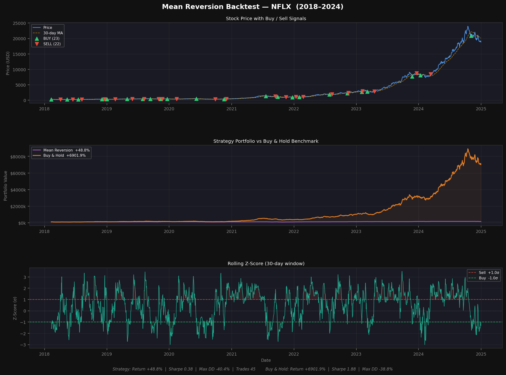

# Mean-Reversion-Backtester
> A z-score-based mean reversion trading strategy backtested on Netflix (NFLX), 2018-2024.

Prices that deviate significantly from their rolling average tend to snap back. This project quantifies that tendency: it generates **BUY signals when the 30-day z-score drops below -1σ** (oversold) and **SELL signals when it rises above +1σ** (overbought), runs a full trade simulation with 0.1% transaction costs, and benchmarks the result against passive buy-and-hold.

---

## Strategy at a Glance

\`\`\`
Rolling Z-Score = (Price - 30-day Mean) / 30-day Std

z < -1.0  →  BUY   (price unusually low, reversion upward expected)
z > +1.0  →  SELL  (price unusually high, reversion downward expected)
\`\`\`

- One position at a time: fully invested **or** fully in cash
- No leverage, no shorting
- 0.1% transaction cost applied on every trade
- `.shift(1)` on position ensures no look-ahead bias

---

## Project Structure

\`\`\`
quant-backtest-mean-reversion/
├──   Mean-Reversion-Backtester.ipynb         ← Full pipeline: data → signals → simulation → charts
├── README.md            ← This file
├── backtest_results.png ← Output chart (generated on run)

\`\`\`

---

## Quick Start

### Local

\`\`\`bash
pip install -r requirements.txt
python Mean-Reversion-Backtester.ipynb 
\`\`\`

### Google Colab

\`\`\`python
!pip install yfinance pandas numpy matplotlib
exec(open("Mean-Reversion-Backtester.ipynb ").read())
\`\`\`

---

## Configuration

All parameters live at the top of `Mean-Reversion-Backtester.ipynb `:

| Variable          | Default        | Description                        |
|-------------------|----------------|------------------------------------|
| `TICKER`          | `"NFLX"`       | Any yfinance-compatible ticker     |
| `START_DATE`      | `"2018-01-01"` | Backtest start                     |
| `END_DATE`        | `"2024-12-31"` | Backtest end                       |
| `INITIAL_CAPITAL` | `100_000`      | Starting portfolio value (USD)     |
| `WINDOW`          | `30`           | Rolling z-score lookback (days)    |
| `Z_BUY`           | `-1.0`         | Entry threshold (σ)                |
| `Z_SELL`          | `+1.0`         | Exit threshold (σ)                 |
| `COST`            | `0.001`        | Per-trade transaction cost (0.1%)  |

---

## Output

Three-panel dark-theme chart saved as `backtest_results.png`:

1. **Price + Signals** — close price, 30-day MA, BUY/SELL markers
2. **Portfolio vs Benchmark** — cumulative strategy value vs buy-and-hold
3. **Rolling Z-Score** — z-score with ±1σ threshold bands shaded

Console output:

\`\`\`
Metric           Strategy   Buy & Hold
------------------------------------------
Total Return       xx.xx%      xx.xx%
Sharpe Ratio        x.xxx       x.xxx
Max Drawdown      -xx.xx%     -xx.xx%
Total Trades           xx
\`\`\`

---

## Key Insights & Limitations

**What works well**
- Captures reversion edge in range-bound, sideways markets
- Lower market exposure can reduce drawdown in volatile periods

**Limitations**
- Underperforms during strong directional trends
- Flat % cost only — real slippage is order-size dependent
- Single ticker, single parameter set — not a robust out-of-sample study
- No short selling; exits go to cash rather than reversing the position

---

## Dependencies

\`\`\`
yfinance>=0.2.36
pandas>=2.0.0
numpy>=1.26.0
matplotlib>=3.8.0
\`\`\`

---

*Built with Python · yfinance · pandas · NumPy · Matplotlib*
